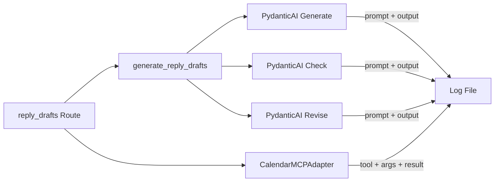

# design.md — バックエンド AI/MCP ログ出力 設計

## 方針（DDD 境界・責務分割）

- ログは **Infrastructure 層** で記録する（AI Adapter / MCP Adapter 内）。Domain は変更しない。Application は Port 経由で呼ぶだけのため、ログは Adapter の責務とする。
- Python 標準の `logging` を用い、ファイルハンドラーで所定のログファイルに書き出す。
- 専用ロガー名（例: `settlement_maker.ai_mcp`）と専用ログファイルを設け、uvicorn 等の既存ログと識別しやすくする。

## データフロー（ログの流れ）

## 記録対象の具体

- **AI**: アダプタ名（generate / check / revise）、user_prompt（全文または長さ制限付き）、`result.output` の JSON 的表現（または repr）。
- **MCP**: ツール名（list-calendars / list-events）、引数（calendarId 等）、`direct_call_tool` の戻り値（文字列化した内容）。
- **機密削減**: 本番ではプロンプトをマスクするオプションや、ログレベルで制御する案を代替案に記載する。

## API 変更

- なし。ログは副作用のみ。エンドポイント・リクエスト/レスポンスは変更しない。

## 代替案

- **A) 標準 logging + FileHandler で専用ログファイルに出力**  
  → 採用候補。専用ロガー・専用ファイルで AI/MCP の入出力だけを追いやすい。
- **B) 既存の uvicorn ログに混在させる**  
  → 識別しづらいため、専用ロガー・専用ファイルを推奨。
- **C) ログに個人情報を含めない（プロンプトをハッシュのみ等）**  
  → デバッグ目的なら全文を残し、本番用は別タスクで検討。

## テスト戦略

- **Unit**: Adapter のメソッド実行時にログが記録されることをモックまたは一時ファイルで検証する。
- **Integration**: 既存の reply_drafts API テストが通ること。必要なら「ログ出力が行われた」ことをアサートするテストを 1 本追加する。
- **既存テスト**: 挙動不変のため、既存の pytest はすべてパスすることを確認する。

## ドキュメント更新方針

- `./docs/implementation-tasklist.md`: 新規タスク「B10: バックエンド AI/MCP ログ出力」を追加し、完了時にステータス・完了日を反映する。
- `./docs/architecture.md`: 運用・観測の節があれば「AI/MCP の入出力ログ」を追記。なければ簡潔に 1 段落追加する。

## 全体タスクリスト反映方針

- 上記 B10 として `./docs/implementation-tasklist.md` の「2. バックエンド」に 1 行追加する。完了時に完了日・備考を記載する。

---

## 結果と学び（モード3・振り返り）

- **実施内容**: 専用ロガー `settlement_maker.ai_mcp` と `ai_mcp_logging.py` を新規作成。環境変数 `AI_MCP_LOG_PATH`（未設定時は `ai_mcp.log`）に FileHandler で出力。PydanticAI の Generate / Check / Revise 各所で `ai_adapter=<名> prompt=... output=...` を INFO で記録。Calendar MCP Adapter で `list-calendars` / `list-events` の呼び出し後に `mcp_tool=... args=... result=...` を記録。単体テストでロガー名・ファイル出力・Adapter のログ呼び出しを検証。
- **受け入れ条件**: 既存 35 テストパス。AI_MCP_LOG_PATH 設定時にログファイルに書き込まれることを確認。
- **想定外**: なし。既存の ruff E402/E501 は calendar_mcp_adapter・pydantic_ai_adapters に残っており、本タスクでは新規ファイル・追加コードのみ lint 通過させた。
- **改善点**: 本番でのローテーション・保持期間・プロンプトマスクは別タスクで検討可能。
