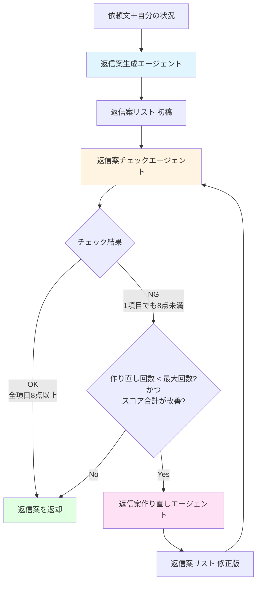

# 上司案件・落とし所AIエージェント

**「今日中に」を今日中にしないAI**

依頼文と自分の状況を入力すると、角の立たない断り・代替案・確認質問・次の一手（返信案）を生成するデモアプリです。

---

## 概要

相手（上司など）の依頼文と、自分の状況（残り時間・優先度・制約）を入力すると、AI が返信案を1件生成します。ユーザーは返信案をコピーしてメール・チャット等で利用できます。

- **入力**: 依頼文（自由文）、残り時間（数値）、優先度（3段階）、制約（自由文）
- **出力**: 返信案1件（角の立たない断り・代替案・確認質問・次の一手を含む）
- **利用形態**: デモアプリ（認証なし）

---

## AIエージェントの処理フロー

本アプリは、**複数のAIエージェント**を組み合わせて返信案の品質を高めます。

### 処理フロー



### エージェントの役割

| エージェント | 役割 | 評価基準 |
|------------|------|---------|
| **返信案生成エージェント** | 依頼文と自分の状況から返信案の初稿を生成 | - |
| **返信案チェックエージェント** | 生成された返信案を3項目で評価（各10点満点） | 1) 角が立っていないか<br>2) 代替案・確認質問が適切か<br>3) 依頼文・制約に反していないか |
| **返信案作り直しエージェント** | チェック結果の指摘（must_fix / nice_to_have）を基に返信案を修正 | - |

### 終了条件

返信案は以下のいずれかの条件で確定します：

1. **チェックがOK**: 3項目すべてが8点以上
2. **最大作り直し回数に達した**: デフォルトは2回まで
3. **スコア合計が改善しない**: 前回と同点または悪化した場合

詳細は [architecture.md](docs/architecture.md) の「3.5 複数エージェントの組み合わせ」を参照してください。

---

## 技術スタック

| 層 | 技術 |
|----|------|
| フロントエンド | React/Next.js |
| バックエンド | Python 3.x, FastAPI |
| AI | PydanticAI + OpenAI（gpt-4o-mini、環境変数で変更可能） |
| 認証 | なし（デモ用途） |

---

## 前提条件

- **Python 3.x** — バックエンド用（[uv](https://docs.astral.sh/uv/) 推奨）
- **Node.js** — フロントエンド用（npm / pnpm / yarn のいずれか）
- **OpenAI API キー** — 環境変数で設定（後述）

---

## 起動方法

### クイックスタート（Windows）

プロジェクトルートで `start-dev.ps1` を実行すると、バックエンドとフロントエンドを別ウィンドウで起動します。

```powershell
.\start-dev.ps1
```

- バックエンド: http://localhost:8000
- フロントエンド: http://localhost:3000
- API ドキュメント: http://localhost:8000/docs

> **注意**: バックエンドで AI 生成を使う場合は、バックエンドのウィンドウで `OPENAI_API_KEY` 環境変数を設定してください。

### 手動起動

#### バックエンド（FastAPI）

```bash
cd backend
uv sync
# 環境変数 OPENAI_API_KEY を設定してから
uv run uvicorn settlement_maker.interface.app:app --reload
```

- 依存管理・実行: [uv](https://docs.astral.sh/uv/)（`uv sync`, `uv run ...`）
- テスト: `uv run pytest -q`
- 静的解析: `uv run ruff check .` / `uv run ruff format .` / `uv run mypy .`

#### フロントエンド（Next.js）

```bash
cd frontend
npm install   # または pnpm i / yarn
npm run dev   # Next.js 開発サーバ起動（next dev）
```

- テスト: `npm test`（または `npm run test`）
- lint/format: `npm run lint` / `npm run format`

### 環境変数

#### バックエンド

- **OPENAI_API_KEY** — OpenAI API キー（必須）。環境変数で設定してください。
  ```bash
  # Windows (PowerShell)
  $env:OPENAI_API_KEY = "your-api-key"
  
  # Linux/Mac
  export OPENAI_API_KEY="your-api-key"
  ```
- **OPENAI_MODEL** — 使用する OpenAI モデル（任意、デフォルト: `gpt-4o-mini`）

#### フロントエンド

- **NEXT_PUBLIC_API_BASE_URL** — バックエンドのベース URL（任意、デフォルト: `http://localhost:8000`）
  - `.env.local` ファイルを作成して設定してください（`.env.local.example` を参考）

### API エンドポイント

- **POST /api/v1/reply-drafts** — 返信案生成
  - リクエスト: `{ "request_text": string, "remaining_hours": number?, "priority": "high"|"medium"|"low"?, "constraints": string? }`
  - レスポンス: `{ "draft": { "text": string } }`

---

## ドキュメント

仕様・設計・用語は `./docs` で管理しています。

| ドキュメント | 内容 |
|--------------|------|
| [product-requirements.md](docs/product-requirements.md) | プロダクト要求定義書 |
| [functional-design.md](docs/functional-design.md) | 機能設計書 |
| [architecture.md](docs/architecture.md) | 技術仕様書 |
| [repository-structure.md](docs/repository-structure.md) | リポジトリ構造 |
| [development-guidelines.md](docs/development-guidelines.md) | 開発ガイドライン |
| [glossary.md](docs/glossary.md) | 用語定義 |
| [implementation-tasklist.md](docs/implementation-tasklist.md) | 実装タスクリスト（全体進捗） |
| [adr/](docs/adr/) | Architecture Decision Records（ADR） |

- **AI / 開発者向け**: リポジトリルートの [AGENTS.md](AGENTS.md) が最優先ルール（TDD・DDD・ステアリング・契約）です。

---

## ライセンス

（未定。必要に応じて追記してください。）
