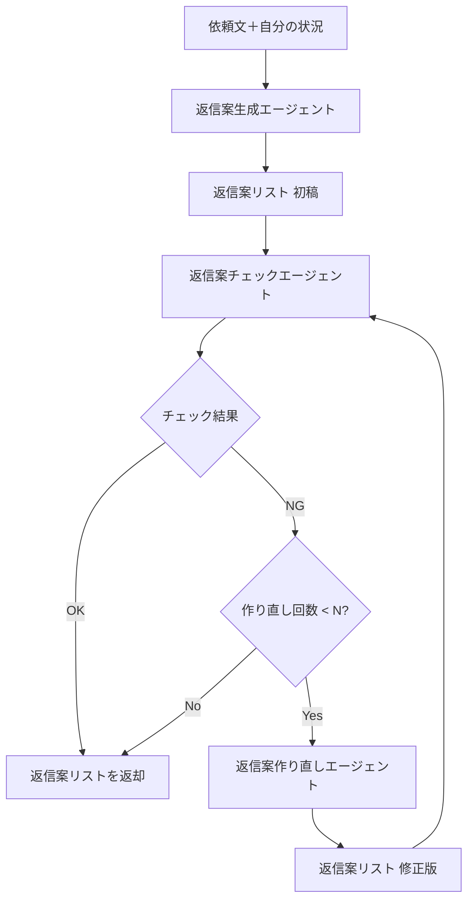

# 技術仕様書（Architecture）

## 1. 技術スタック

| 層 | 技術 | 備考 |
|----|------|------|
| フロントエンド | React/Next.js | UI・入力・API呼び出し・返信案表示・コピー（App Router 採用） |
| バックエンド | Python 3.x, FastAPI | API・入力検証・ユースケース・PydanticAI 呼び出し |
| AI | PydanticAI + OpenAI | エージェント・プロンプト・モデル呼び出し |
| AIモデル | gpt-5-mini | 実装時に API で利用可能なモデル名に合わせる（gpt-4o-mini 等の可能性あり） |
| 認証 | なし | デモアプリのため認証・DB なし |

---

## 2. システム構成（概要）

```
[ブラウザ] ←→ [Next.js (FE)] ←→ [FastAPI (BE)] ←→ [複数 PydanticAI エージェント] ←→ [OpenAI API]
```

- FE: 単一画面。依頼文・自分の状況の入力、生成実行、返信案一覧表示・コピー。
- BE: REST API。依頼文＋自分の状況を受け取り、**複数 AI エージェント**（生成→チェック→作り直し）で返信案を組み立て、返信案リストを返す。
- 永続化: 初版では DB なし。認証・履歴保存なし。

---

## 3. バックエンド（FastAPI）アーキテクチャ

### 3.1 レイヤ責務（DDD 方針）

| レイヤ | 責務 | 本プロダクトでの主な内容 |
|--------|------|---------------------------|
| **Domain** | エンティティ・値オブジェクト・集約・ドメインルール。I/O禁止。 | 依頼文・自分の状況・返信案のドメインモデル（必要に応じて）。 |
| **Application** | ユースケース。Domain を組み合わせ、Port 越しにインフラ利用。 | 返信案生成ユースケース。AI呼び出しは Port（抽象）経由。 |
| **Infrastructure** | 外部API・DB等の具体実装（Adapter）。 | 複数 PydanticAI エージェント（生成・チェック・作り直し）を呼ぶ Adapter。 |
| **Interface (Presentation)** | FastAPI ルータ・DTO・入力検証・エラーマッピング。 | 依頼文＋自分の状況の DTO、返信案リストの DTO、ルータ。 |

### 3.2 依存関係ルール

- Domain は Application / Infrastructure / Interface に依存しない。
- Application は Domain に依存してよい。外部I/O（AI呼び出し）は Port（抽象）経由。
- Infrastructure / Interface は Domain + Application に依存してよい。

### 3.3 API 契約（概要）

- **エンドポイント**: `POST /api/v1/reply-drafts`（確定）
- **リクエスト**（JSON body）
  - `request_text`: 依頼文（文字列・必須・非空）
  - `remaining_hours`: 残り時間（数値・任意・0以上）
  - `priority`: 優先度（"high" | "medium" | "low"・任意）
  - `constraints`: 制約（文字列・任意・空文字可）
- **レスポンス**（200）
  - `draft`: 返信案 1 件（`{ "text": string }`）
- **エラー**: ValidationError は 422 で統一。

### 3.4 AI 呼び出し（PydanticAI）

- バックエンドの AI 呼び出しは **PydanticAI** で実装する。
- モデルは gpt-5-mini（または API 仕様に合わせた同等モデル）。各エージェントで共通または個別に指定可能とする。
- OpenAI API キーは環境変数で注入（コードに埋め込まない）。

### 3.5 複数エージェントの組み合わせ（生成→チェック→作り直し）

返信案の品質を高めるため、**複数の AI エージェント**を組み合わせたフローとする。

| 役割 | エージェント | 入力 | 出力 |
|------|--------------|------|------|
| **生成** | 返信案生成エージェント | 依頼文＋自分の状況 | 返信案リスト（初稿・1件） |
| **チェック** | 返信案チェックエージェント | 返信案リスト＋依頼文・自分の状況 | チェック結果（scores: 3項目の数値、must_fix: 必須修正、nice_to_have: 任意改善） |
| **作り直し** | 返信案作り直しエージェント | 返信案リスト＋チェック指摘（must_fix / nice_to_have）＋依頼文・自分の状況 | 返信案リスト（修正版・1件） |

**フロー**

1. **生成**: 依頼文＋自分の状況 → 返信案生成エージェント → 返信案リスト（初稿）
2. **チェック**: 返信案リスト＋依頼文・状況 → 返信案チェックエージェント → チェック結果（3項目を10点満点で評価。全て8以上でOK、1つでも8未満ならNG。出力は scores / must_fix（必須修正・箇条書き）/ nice_to_have（任意改善・箇条書き））
3. **作り直し（条件付き）**: チェックが NG の場合、must_fix / nice_to_have を渡して返信案作り直しエージェントを実行 → 返信案リスト（修正版）
4. **終了条件**: チェックが OK、または **最大 N 回**の作り直しに達した場合、または **スコア合計が前回から改善しない**（同点・悪化）場合に終了。最終的な返信案 1 件を API レスポンスの `draft` として返す。

**処理フロー図**



- 生成・チェック・作り直しは、Application 層からは **Port（抽象）** 経由で呼び出す。Infrastructure が各 PydanticAI エージェントを実装する。
- 最大作り直し回数 N は実装時に定義する（例: 1〜2 回）。無限ループを避ける。
- **チェックの基準**: 返信案チェックエージェントは次の3項目をそれぞれ10点満点（0〜10）で評価する。1) 角が立っていないか、2) 代替案・確認質問が適切か、3) 依頼文・制約に反していないか。**3項目すべてが8以上で合格**。1つでも8未満なら NG とし、feedback に改善点を返して作り直しエージェントに渡す。

---

## 4. フロントエンド（React/Next.js）アーキテクチャ

- **ルーティング**: Next.js の **App Router** を採用する。ルーティングは `app/` 配下で行う。クライアント専用の機能は `'use client'` を明示する。
- **データ取得**: サーバーコンポーネント／クライアントコンポーネントの役割分担を設計で明示する。API 呼び出しはクライアント側（またはサーバーアクション）で行う。
- **環境変数**: フロントから参照する API のベース URL 等は `NEXT_PUBLIC_*` で渡す。

### 4.1 責務

- **表示**: 依頼文・自分の状況の入力フォーム、返信案一覧、コピー操作。
- **操作**: 生成実行、返信案のコピー。
- 業務ルールは BE（Domain）に寄せ、FE のルールは UI 都合（表示制御・入力補助・UX）に限定する。

### 4.2 状態・API呼び出し

- サーバー状態（生成結果）は React Query 等に寄せる方針を推奨（既存方針があれば従う）。
- API クライアントは一箇所に集約（`api/` や `services/`）。
- エラーハンドリングは統一（HTTP ステータス → UI メッセージ）。

### 4.3 型・契約

- 可能なら OpenAPI から TypeScript 型を生成し、API 契約と整合させる。

---

## 5. 契約駆動・互換性

- API 契約（OpenAPI / DTO）を先に更新し、FE / BE を追従する。
- 破壊的変更は避け、必要ならフィールド追加や v1/v2 併存で段階移行する。

---

## 6. 開発・実行環境

- **BE**: Python 3.x、uv で依存管理・実行（`uv sync`, `uv run ...`）。pytest でテスト。
- **FE**: Node.js、package.json の scripts を優先。Next.js の場合は `npm run dev`（`next dev`）、`npm run build`（`next build`）等、Next.js 標準の scripts に従う。lockfile に従う。
- **環境変数**: OpenAI API キー等は環境変数で渡す。

---

## 7. 参照

- [AGENTS.md](../AGENTS.md) — レイヤ責務・TDD・契約の詳細
- [functional-design.md](functional-design.md) — データフロー・API概要
- [repository-structure.md](repository-structure.md) — ディレクトリ構成
- [adr-0002-複数AIエージェント生成チェック作り直しフロー.md](adr/adr-0002-複数AIエージェント生成チェック作り直しフロー.md) — 複数エージェント（生成→チェック→作り直し）の決定理由
